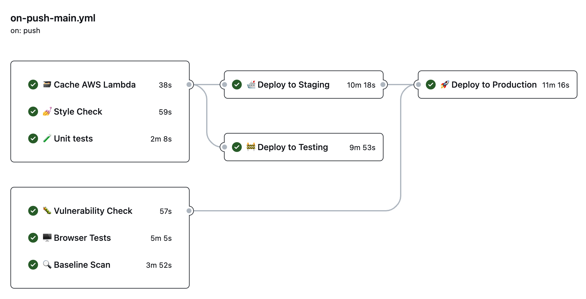

# LBH Core pathway pilot

[](https://github.com/LBHackney-IT/lbh-core-pathway-pilot/actions/workflows/on-push-main.yml)
[](https://github.com/LBHackney-IT/lbh-core-pathway-pilot/actions/workflows/upload-content-files.yml)

---


<p align="center">
    <em>Example screens from the app</em>
</p>

---

🚨 **This is experimental BETA software. No guarantees of stability are made.** 🚨

This is the codebase for the beta prototype being used for a pilot of the new core pathway for adult social care.

It expands on the form-building features of the [mainstream tool](https://github.com/LBHackney-IT/lbh-social-care-frontend/wiki/How-to-create-and-modify-forms).

Users can:

- start, resume and complete workflows
- approve workflows on behalf of other users
- review and reassess workflows using a novel side-by-side interface
---

## 🧱 How it's built

It's a [Next.js](https://nextjs.org) app backed by a [PostgreSQL](https://www.postgresql.org) database, that interacts with:

- The [Social Care Case Viewer API](https://github.com/LBHackney-IT/social-care-case-viewer-api/), in order to grab basic biographical information about the resident in question
- [Contentful](https://www.contentful.com/), to provide a user-friendly way to define form flows and questions

It uses [Prisma](https://www.prisma.io/) to speak to the database and [NextAuth](https://next-auth.js.org/) to handle Google login.


---

## Contents

- [💻 Getting started](#-getting-started)
  - [Prerequisites](#prerequisites)
  - [1. Create a `.env` file](#1-create-a-env-file)
  - [2. Install dependencies](#2-install-dependencies)
  - [3. Update `/etc/hosts` file](#3-update-etchosts-file)
  - [4. Prepare database usage](#4-prepare-database-usage)
- [🧑‍💻 Usage](#-usage)
  - [Running the application](#running-the-application)
  - [Running tests](#running-tests)
  - [Running other checks](#running-other-checks)
  - [Making a database schema change](#making-a-database-schema-change)
- [🗃 Documentation](#-documentation)
  - [Deployment](#deployment)
  - [Infrastructure](#infrastructure)
  - [Continuous Integration / Continuous Deployment (CI/CD)](#continuous-integration--continuous-deployment-cicd)
  - [Configuration](#configuration)
    - [Forms](#forms)
    - [Next steps](#next-steps)

## 💻 Getting started

### Prerequisites

- [Node.js (v14)](https://nodejs.dev)
- [npm (v6)](https://www.npmjs.com)
- [PostgreSQL](https://www.postgresql.org)

### 1. Create a `.env` file

To create a `.env` file from the `.env.sample`, run:

```
cp .env.sample .env
```

Then fill in the values for each environment variable.

### 2. Install dependencies

```
npm install
```

### 3. Update `/etc/hosts` file

The Hackney authentication service requires the application to run on a
`hackney.gov.uk` subdomain. To be able to access the application, add the
following to your `/etc/hosts` file:

```
# Hackney Social Care Frontend
127.0.0.1       dev.hackney.gov.uk
```

### 4. Prepare database usage

Assuming you have a local PostgreSQL database version running and `DATABASE_URL`
in your `.env` points to it, run:

```
npm run build:prisma
npm run db:push
```

## 🧑‍💻 Usage

### Running the application

To be able to sign into the application, you'll need to have a Hackney Google
account and be part of the one of the [allowed Google Groups](./config/allowedGroups.ts).


```
npm run dev
```

The app will then be at [dev.hackney.gov.uk:3000](http://dev.hackney.gov.uk:3000).

### Running tests

Unit tests use [Jest](https://jestjs.io) and for component or page tests, we
utilise the [React Testing Library](https://testing-library.com), to run all
tests:

```
npm run test
```

Browser tests use [Cypress](https://www.cypress.io). There are three Cypress specs:

- Browse, inspect and reassign workflows from the UI
- Beginning a brand new workflow
- Reviewing and reassessing a workflow

To interactively run them:

```
npm run db:seed
NEXT_PUBLIC_ENV=test NODE_ENV=test NEXTAUTH_URL=http://localhost:3000 npm run dev
npm run cypress:open
```

### Running other checks

As the application is written in TypeScript, it's important to run a type check.

```
npm run typecheck
```

[ESLint](https://eslint.org) is used to lint code.

```
npm run lint
```

To run linting, type check and unit tests:

```
npm run check
```

### Making a database schema change

1. Update `prisma/schema.prisma`
2. Migrate your local database

```
npm run db:push
```

3. Update Prisma types

```
npm run build:prisma
```

4. Run all checks and fix any fixtures for tests

```
npr run check
```

To find out more about database migrations, see [Prisma's documentation about db:push](https://www.prisma.io/docs/concepts/components/prisma-migrate/db-push).

## 🗃 Documentation

### Deployment

We have three environments:

- Staging
- Testing
- Production

The application is hosted as a Lambda.

### Infrastructure

We utilise AWS infrastucture. For deploying the Lambdas, we use the [Serverless framework](https://www.serverless.com) (see [serverless.yml](./serverless.yml)).

For managing the database and other resource, we use [Terraform](https://www.terraform.io) that is defined within the [Infrastructure repository](https://github.com/LBHackney-IT/infrastructure/tree/master/projects/social-care-workflows).

### Continuous Integration / Continuous Deployment (CI/CD)

For our CI/CD pipeline, we utilise [GitHub Actions](https://github.com/features/actions). The main pipeline is defined in `.github/workflows/on-push-main.yml` which runs tests and handles deployment.



### Configuration

#### Forms

Forms or assessments are configured in Contentful and saved as a JSON file for the application to use, the update to a form works like so:

1. A change is published in Contentful
2. The change triggers the GitHub Action workflow `.github/workflows/upload-content-files.yml` which makes a commits a change to the `config/forms/forms.json` to the repository
3. For staging, the updated `forms.json` replaces the current one in our AWS S3 bucket

The application then gets the latest form config from S3 or falls back to the
local version. Utilising S3 means we can make changes to questions, fields, etc.
without going through the whole deployment pipeline.

4. To deploy the changes for production, approval is needed.

To manually update the forms config, run:

```
npm run import:contentful:forms
```

#### Next steps

Next steps are the steps that can happen after an assessment is completed. This
configuration works similarly to forms although at the moment its JSON file
(`config/nextSteps/nextStepOptions.json`) is not automatic and has to be
manually updated by running:

```
npm run import:contentful:next-steps
```

Then committed and pushed.
